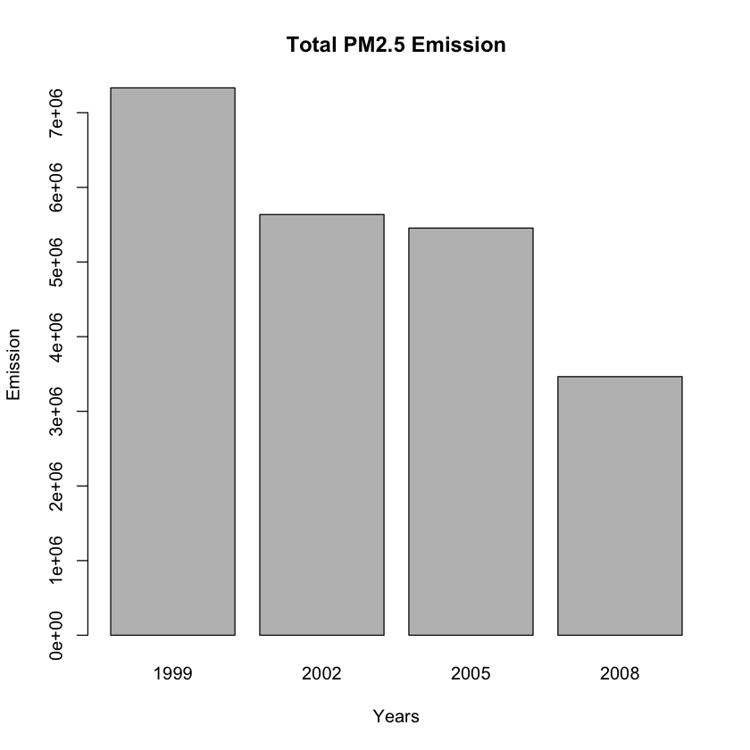
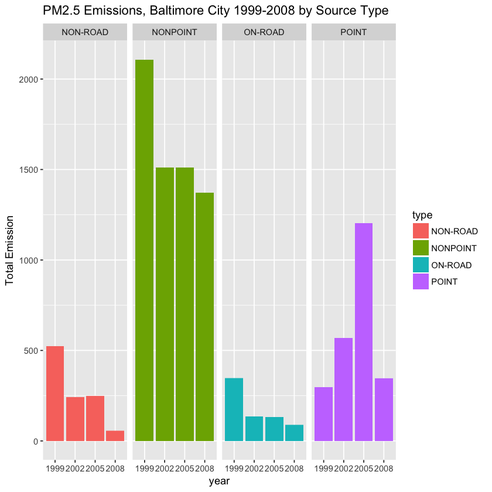
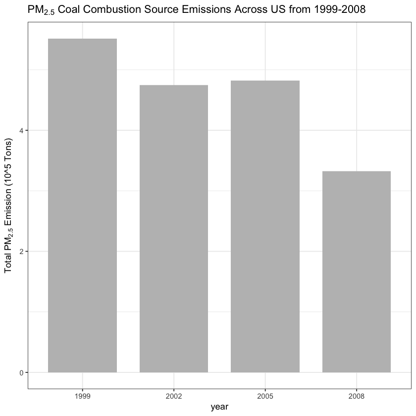
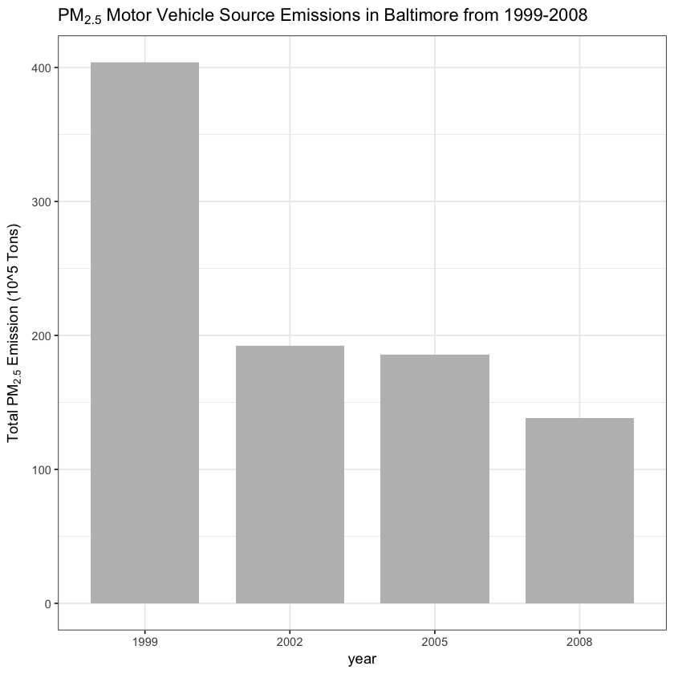
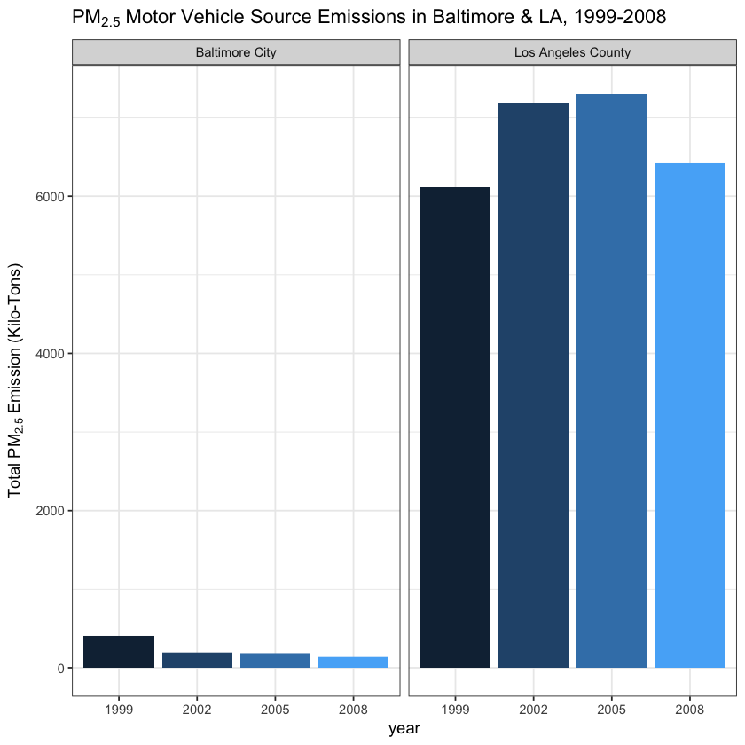

# Project

#### Questions:

1. Have total emissions from PM2.5 decreased in the United States from 1999 to 2008? Using the base plotting system, make a plot showing the total PM2.5 emission from all sources for each of the years 1999, 2002, 2005, and 2008.

2. Have total emissions from PM2.5 decreased in the Baltimore City, Maryland (𝚏𝚒𝚙𝚜 == "𝟸𝟺𝟻𝟷𝟶") from 1999 to 2008? Use the base plotting system to make a plot answering this question.

3. Of the four types of sources indicated by the 𝚝𝚢𝚙𝚎 (point, nonpoint, onroad, nonroad) variable, which of these four sources have seen decreases in emissions from 1999–2008 for Baltimore City? Which have seen increases in emissions from 1999–2008? Use the ggplot2 plotting system to make a plot answer this question.

4. Across the United States, how have emissions from coal combustion-related sources changed from 1999–2008?

5. How have emissions from motor vehicle sources changed from 1999–2008 in Baltimore City?

6. Compare emissions from motor vehicle sources in Baltimore City with emissions from motor vehicle sources in Los Angeles County, California (𝚏𝚒𝚙𝚜 == "𝟶𝟼𝟶𝟹𝟽"). Which city has seen greater changes over time in motor vehicle emissions?


```R
NEI <- readRDS("summarySCC_PM25.rds")
SCC <- readRDS("Source_Classification_Code.rds")
```


```R
dim(NEI)
head(NEI)
range(NEI$Emissions)
```


<ol class=list-inline>
	<li>6497651</li>
	<li>6</li>
</ol>


<table>
<thead><tr><th></th><th scope=col>fips</th><th scope=col>SCC</th><th scope=col>Pollutant</th><th scope=col>Emissions</th><th scope=col>type</th><th scope=col>year</th></tr></thead>
<tbody>
	<tr><th scope=row>4</th><td>09001   </td><td>10100401</td><td>PM25-PRI</td><td> 15.714 </td><td>POINT   </td><td>1999    </td></tr>
	<tr><th scope=row>8</th><td>09001   </td><td>10100404</td><td>PM25-PRI</td><td>234.178 </td><td>POINT   </td><td>1999    </td></tr>
	<tr><th scope=row>12</th><td>09001   </td><td>10100501</td><td>PM25-PRI</td><td>  0.128 </td><td>POINT   </td><td>1999    </td></tr>
	<tr><th scope=row>16</th><td>09001   </td><td>10200401</td><td>PM25-PRI</td><td>  2.036 </td><td>POINT   </td><td>1999    </td></tr>
	<tr><th scope=row>20</th><td>09001   </td><td>10200504</td><td>PM25-PRI</td><td>  0.388 </td><td>POINT   </td><td>1999    </td></tr>
	<tr><th scope=row>24</th><td>09001   </td><td>10200602</td><td>PM25-PRI</td><td>  1.490 </td><td>POINT   </td><td>1999    </td></tr>
</tbody>
</table>


<ol class=list-inline>
	<li>0</li>
	<li>646951.97</li>
</ol>


```R
Total.Emission <- aggregate(Emissions ~ year, NEI, sum)
barplot(Total.Emission$Emissions, main = 'Total PM2.5 Emission', xlab = 'Years', ylab = 'Emission', 
        names.arg = Total.Emission$year)
```





Based on the barplot, the total emission did decrease throughtout the years.


```R
Baltimore.Data <- subset(NEI, fips == '24510')
Bal.Tot.Emission <- aggregate(Emissions ~ year, Baltimore.Data, sum)
barplot(Bal.Tot.Emission$Emissions, main = 'Total PM2.5 Emission in Baltimore', xlab = 'Years', ylab = 'Emission', 
        names.arg = Bal.Tot.Emission$year)
```


Generally speaking, the total emission decreased in Baltimore from 1999 to 2008, but year 2005 has emission higher than year 2008.


```R
library(ggplot2)
p <- ggplot(Baltimore.Data, aes(as.factor(year), Emissions, fill = type))
p1 <- p + geom_bar(stat = 'identity') + facet_grid(.~type) 
p1 + labs(x = "year", y = expression("Total Emission")) + labs(title = 'PM2.5 Emissions, Baltimore City 1999-2008 by Source Type')
```





The non-road, nonpoint, on-road source types have all seen decreased emissions overall from 1999-2008 in Baltimore City. The point source saw a slight increase overall from 1999-2008. Also note that the point source saw a significant increase until 2005 at which point it decreases again by 2008 to just above the starting values.


```R
head(SCC)
```


<table>
<thead><tr><th scope=col>SCC</th><th scope=col>Data.Category</th><th scope=col>Short.Name</th><th scope=col>EI.Sector</th><th scope=col>Option.Group</th><th scope=col>Option.Set</th><th scope=col>SCC.Level.One</th><th scope=col>SCC.Level.Two</th><th scope=col>SCC.Level.Three</th><th scope=col>SCC.Level.Four</th><th scope=col>Map.To</th><th scope=col>Last.Inventory.Year</th><th scope=col>Created_Date</th><th scope=col>Revised_Date</th><th scope=col>Usage.Notes</th></tr></thead>
<tbody>
	<tr><td>10100101                                                                  </td><td>Point                                                                     </td><td>Ext Comb /Electric Gen /Anthracite Coal /Pulverized Coal                  </td><td>Fuel Comb - Electric Generation - Coal                                    </td><td>                                                                          </td><td>                                                                          </td><td>External Combustion Boilers                                               </td><td>Electric Generation                                                       </td><td>Anthracite Coal                                                           </td><td>Pulverized Coal                                                           </td><td>NA                                                                        </td><td>NA                                                                        </td><td>                                                                          </td><td>                                                                          </td><td>                                                                          </td></tr>
	<tr><td>10100102                                                                  </td><td>Point                                                                     </td><td>Ext Comb /Electric Gen /Anthracite Coal /Traveling Grate (Overfeed) Stoker</td><td>Fuel Comb - Electric Generation - Coal                                    </td><td>                                                                          </td><td>                                                                          </td><td>External Combustion Boilers                                               </td><td>Electric Generation                                                       </td><td>Anthracite Coal                                                           </td><td>Traveling Grate (Overfeed) Stoker                                         </td><td>NA                                                                        </td><td>NA                                                                        </td><td>                                                                          </td><td>                                                                          </td><td>                                                                          </td></tr>
	<tr><td>10100201                                                                  </td><td>Point                                                                     </td><td>Ext Comb /Electric Gen /Bituminous Coal /Pulverized Coal: Wet Bottom      </td><td>Fuel Comb - Electric Generation - Coal                                    </td><td>                                                                          </td><td>                                                                          </td><td>External Combustion Boilers                                               </td><td>Electric Generation                                                       </td><td>Bituminous/Subbituminous Coal                                             </td><td>Pulverized Coal: Wet Bottom (Bituminous Coal)                             </td><td>NA                                                                        </td><td>NA                                                                        </td><td>                                                                          </td><td>                                                                          </td><td>                                                                          </td></tr>
	<tr><td>10100202                                                                  </td><td>Point                                                                     </td><td>Ext Comb /Electric Gen /Bituminous Coal /Pulverized Coal: Dry Bottom      </td><td>Fuel Comb - Electric Generation - Coal                                    </td><td>                                                                          </td><td>                                                                          </td><td>External Combustion Boilers                                               </td><td>Electric Generation                                                       </td><td>Bituminous/Subbituminous Coal                                             </td><td>Pulverized Coal: Dry Bottom (Bituminous Coal)                             </td><td>NA                                                                        </td><td>NA                                                                        </td><td>                                                                          </td><td>                                                                          </td><td>                                                                          </td></tr>
	<tr><td>10100203                                                                  </td><td>Point                                                                     </td><td>Ext Comb /Electric Gen /Bituminous Coal /Cyclone Furnace                  </td><td>Fuel Comb - Electric Generation - Coal                                    </td><td>                                                                          </td><td>                                                                          </td><td>External Combustion Boilers                                               </td><td>Electric Generation                                                       </td><td>Bituminous/Subbituminous Coal                                             </td><td>Cyclone Furnace (Bituminous Coal)                                         </td><td>NA                                                                        </td><td>NA                                                                        </td><td>                                                                          </td><td>                                                                          </td><td>                                                                          </td></tr>
	<tr><td>10100204                                                                  </td><td>Point                                                                     </td><td>Ext Comb /Electric Gen /Bituminous Coal /Spreader Stoker                  </td><td>Fuel Comb - Electric Generation - Coal                                    </td><td>                                                                          </td><td>                                                                          </td><td>External Combustion Boilers                                               </td><td>Electric Generation                                                       </td><td>Bituminous/Subbituminous Coal                                             </td><td>Spreader Stoker (Bituminous Coal)                                         </td><td>NA                                                                        </td><td>NA                                                                        </td><td>                                                                          </td><td>                                                                          </td><td>                                                                          </td></tr>
</tbody>
</table>


```R
# Subset coal combustion related NEI data
combustionRelated <- grepl("comb", SCC$SCC.Level.One, ignore.case=TRUE)
coalRelated <- grepl("coal", SCC$SCC.Level.Four, ignore.case=TRUE) 
coalCombustion <- (combustionRelated & coalRelated)
combustionSCC <- SCC[coalCombustion,]$SCC
combustionNEI <- NEI[NEI$SCC %in% combustionSCC,]
```


```R
ggp <- ggplot(combustionNEI,aes(factor(year),Emissions/10^5)) +
  geom_bar(stat="identity",fill="grey",width=0.75) +
  theme_bw() +  guides(fill=FALSE) +
  labs(x="year", y=expression("Total PM"[2.5]*" Emission (10^5 Tons)")) + 
  labs(title=expression("PM"[2.5]*" Coal Combustion Source Emissions Across US from 1999-2008"))

print(ggp)
```





Emissions from coal combustion related sources have decreased from 6 * 10^6 to below 4 * 10^6 from 1999-2008.


```R
vehicles <- grepl("vehicle", SCC$SCC.Level.Two, ignore.case=TRUE)
vehiclesSCC <- SCC[vehicles,]$SCC
vehiclesNEI <- NEI[NEI$SCC %in% vehiclesSCC,]
baltimoreVehiclesNEI <- vehiclesNEI[vehiclesNEI$fips==24510,]
ggp <- ggplot(baltimoreVehiclesNEI,aes(factor(year),Emissions)) +
  geom_bar(stat="identity",fill="grey",width=0.75) +
  theme_bw() +  guides(fill=FALSE) +
  labs(x="year", y=expression("Total PM"[2.5]*" Emission (10^5 Tons)")) + 
  labs(title=expression("PM"[2.5]*" Motor Vehicle Source Emissions in Baltimore from 1999-2008"))
ggp
```





Emissions from motor vehicle sources have dropped from 1999-2008 in Baltimore City!


```R
vehiclesBaltimoreNEI <- vehiclesNEI[vehiclesNEI$fips == 24510,]
vehiclesBaltimoreNEI$city <- "Baltimore City"
vehiclesLANEI <- vehiclesNEI[vehiclesNEI$fips=="06037",]
vehiclesLANEI$city <- "Los Angeles County"
bothNEI <- rbind(vehiclesBaltimoreNEI,vehiclesLANEI)
p <- ggplot(bothNEI, aes(x=factor(year), y=Emissions, fill=city)) +
 geom_bar(aes(fill=year),stat="identity") +
 facet_grid(scales="free", space="free", .~city) +
 guides(fill=FALSE) + theme_bw() +
 labs(x="year", y=expression("Total PM"[2.5]*" Emission (Kilo-Tons)")) + 
 labs(title=expression("PM"[2.5]*" Motor Vehicle Source Emissions in Baltimore & LA, 1999-2008"))
p
```





Los Angeles County has seen the greatest changes over time in motor vehicle emissions.


```R

```
